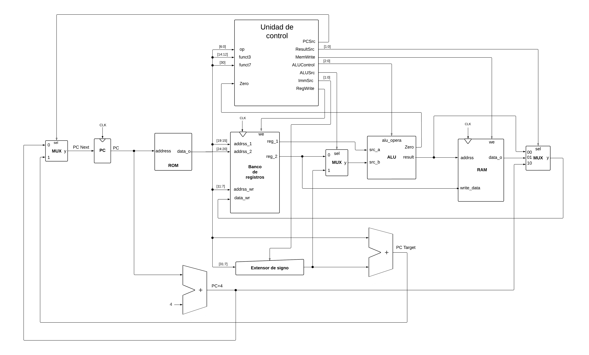
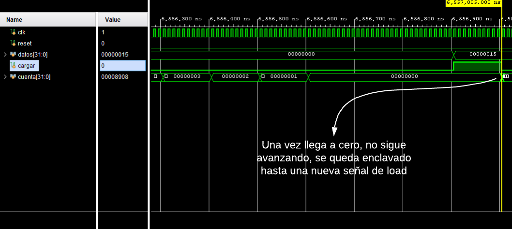
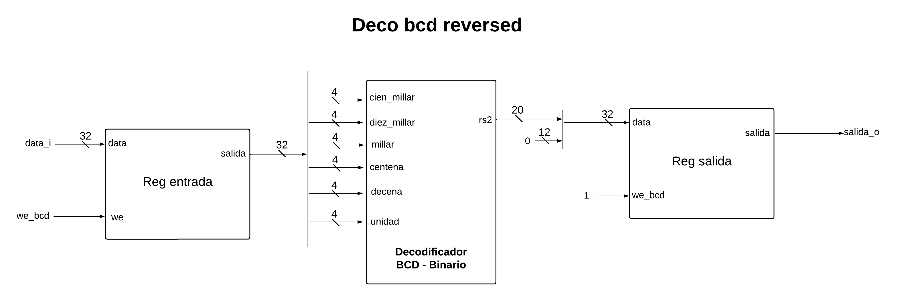

# Lab. 4: Microcontrolador.


## 1. Abreviaturas y definiciones:

- **FPGA**: Field Programmable Gate Arrays.
- **MUX**: Multiplexor.
- **SPI**: Serial Input Interface.
- **UART**: Universal Asynchronous Receiver-Transmitter.
- **RISC**: Reduced Instruction Set Computing.
- **PuTTY**: Cliente SSH, Telnet, rlogin, y TCP raw con licencia libre.
- **RS-232**: Recommended Standard 232.
- **USB**: Universal Serial Bus.
- **ASCII**: American Standard Code for Information Interchange.
- **BCD**: Decimal codificado en Binario.
- **ROM**: Read Only Memory.
- **RAM**: Random-Access Memory.
- **DECO**: Decodificador.
- **REG**: Registro.
- **ALU**: Unidad Lógica Aritmética.
- **LED**: Light-Emitting Diode.
- **DEMUX**: Demultiplexor.
- **IP**: Intellectual Property.

  
## 2. Referencias:
[1] David Harris y Sarah Harris. *Digital Design and Computer Architecture. RISC-V Edition.* Morgan Kaufmann, 2022. ISBN: 978-0-12-820064-3

[2] David Patterson y Andrew Waterman. *Guía Práctica de RISC-V. El Atlas de una Arquitectura Abierta* Traducido por Alí Lemus y Eduardo Corpeño. 11 de Julio de 2018.

[3] Digilent. *Nexys 4.* URL: [Nexys 4](https://digilent.com/reference/programmable-logic/nexys-4/start)

[4] Contributors to Wikimedia projects. *Double dabble - Wikipedia*. Wikipedia, the free encyclopedia. URL: [Double Dabble](https://en.wikipedia.org/wiki/Double_dabble)

[5] Felipe Machado. *Arquitectura de computadores: RISC-V.* (2 de agosto de 2021). URL: [Video RISC-V](https://www.youtube.com/playlist?list=PLSUmB2yTypWGcPlfTymmaQ3HWxvamxfoW)

[6] El código ASCII Completo. *American Standard Code for Information Interchange*. URL: [ASCII](https://elcodigoascii.com.ar/)

## 3. Desarrollo:

### 3.1. Sistema Completo

El módulo del sistema completo, se encarga de interconectar el procesador RISC-V desarrollado con los periféricos solicitados: la memoria RAM, ROM, LEDS, el sistema de sensor de luz con comunicación SPI, el 7 segmentos, timer, interfaz del teclado, interfaz UART, switches.

Además, se le agregaron tres periféricos extra, una ROM con el texto del menú a mostrar, un decodificador de BCD a binario y otro decodificador de binario a BCD, estos con el objetivo de aligerar el microprograma dentro de la ROM principal, a cada periférico extra se le asignó una dirección de memoria disponible, para posteriormente llamarlos y que de esta manera fueran dichos periféricos los encargados de procesar ciertos datos.


#### 3.1.1 Encabezado del módulo

```SystemVerilog
module top_microcontrolador (
    input    logic              clk_pi,              
    input    logic              reset_pi,             
    input    logic  [ 15 : 0 ]  switches_pi,        
    input    logic              ps2_clk_pi,          
    input    logic              ps2_data_pi,        
    input    logic              miso_pi,             
    output   logic              sclk_po,             
    output   logic              mosi_po,             
    output   logic              cs_po,               
    output   logic  [  6 : 0 ]  hex_number_po,       
    output   logic  [  7 : 0 ]  an_po,               
    output   logic              uart_tx_po,          
    output   logic  [ 15 : 0 ]  leds_po);            
```
#### 3.1.2 Parámetros

Este módulo no posee parámetros.

#### 3.1.3 Entradas y salidas

- `clk_pi`: Señal de clock de 100MHz.
- `reset_pi`: Señal de entrada del reset.
- `switches_pi`: Señal de entrada de los switches de la FPGA.
- `ps2_clk_pi`: CLK del bloque PS2.
- `ps2_data_pi`: Dato de entrada del PS2.
- `miso_pi`: Salida miso del SPI.
- `sclk_po`: Salida serial clock del SPI.
- `mosi_po`: Salida mosi del SPI
- `cs_po`: Salida chip select del SPI
- `hex_number_po`: Señal para habilitar los segmentos de los displays
- `an_po`: Señal que habilita los displays
- `uart_tx_po`: Salida del UART
- `leds_po`: Señal de salida de que va hacia los leds en la FPGA

#### 3.1.4 Criterios de diseño

El sistema completo, incluye cierta cantidad de periféricos, estos se controlan por medio del control de buses, que se encarga de generar y recibir las señales necesarias según la instrucción por ejecutar, tanto el control de buses como algunos periféricos se detallan más adelante, en este apartado tan solo se centra la atención en detalles referentes al funcionamiento del sistema completo.

La siguiente figura muestra de forma muy general la conexión que debe tener el procesador con todos los componentes presentes.


Dicha figura es tan solo ilústrativa pues no contiene mayor detalle sobre la función de dichos bloques, no obstante permite visualizar de forma muy general el flujo de datos, ahora bien, desde el punto de vista del procesador los periféricos son vistos como memoria, por lo que un mapa de memoria constituye una forma efectiva de mostrar cómo ve el procesador estos módulos, el mapa de memoria para este proyecto es el que se muestra en la siguiente figura.


Un mapa de memoria muestra en cuáles address se encuentra cada uno de los periféricos, esto es particularmente importante a la hora de desarrollar el control de buses, ya que es el encargado de generar los write enable, además, es importante que se encuentre delimitado para poder realizar el programa en ensamblador, ya que de esta manera es posible tener claro a qué direcciones se debe acceder para comunicarse con cierto periférico.

Por otro lado, como parte de la aplicación la cual consta de 3 modos de operación, se ha planteado el siguiente diagrama de flujo


De forma general para el caso del modo texto el flujo que se debe seguir es; reconocer si se presiona la tecla de ESC, en cuyo caso debería volver la menú, mientras que si no es la tecla de ESC se encargue de mostrar dicho caracter en el PuTTY.

Por otro lado, el modo calculadora, es más complejo, puesto que las operaciones pueden variar con respecto a la cantidad de dígitos, por lo que al ingresar un número se debe validar que es lo siguiente que se ingresa, dejando abierta la posibilidad de que sea un número u operador, no obstante al llegar a 3 dígitos para el primer número, no existe esta posibilidad, pues ya no es posible tomar en cuenta más dígitos, para el segundo dígito funciona de forma similar solo que en esta ocasión no se está validando si se presiona número u operador, si no que se valida si se presiona número o la tecla enter, de forma adicional cada que se presiona un número u operador, se realiza una rutina para mostrar dicho caracter por el PuTTY.

Finalmente, el modo sensor, primero carga el valor que se encuentra en los switches, eso es importante ya que los switches son los que definen el tiempo de captura de datos, una vez que el timer termina, envía lo necesario para poner el SPI a capturar un dato, y posteriormente mostrarlo.


#### 3.1.5 Microprograma implementado

En la siguiente figura, se puede observar el flujo a grandes rasgos, debido a que el microprograma completo se divide en estos bloques:


A continuación se logra observar el código referente al bloque `inicio menú principal`, `Mostrar texto de menú` y `Seleccionar modo`

``` assembly
menu_principal:

addi ra, zero, 0x20        
slli ra, ra, 8       
addi ra, ra, 0x24           # ra = dir mem 2024       uart_data

addi sp, zero, 0x20
slli sp, sp, 8       
addi sp, sp, 0x20           # sp = dir mem 2020       uart_ctrl

addi gp, zero, 0x20
slli gp, gp, 8             # gp = dir mem 2000       teclado

addi t5, zero, 0x30
slli t5, t5, 8             # t5 = dir mem 3000       ROM de texto

addi s9, zero, 0x30        # direccion maxima a la que llega a leer
slli s9, s9, 8
addi s9, s9, 0x184

addi a1, zero, 1             # constante con valor 1
addi t0, zero, 0x05          # constante con valor F1
addi t1, zero, 0x06          # constante con valor F2
addi t2, zero, 0x04          # constante con valor F3

###################################################################################### MOSTRAR TEXTO DE MENU

loop_lector:                     # lee el texto que está guardado en la ROM extra

	lw s1, 0(t5)
	addi t5, t5, 0x4
	beq t5, s9, sel_modo
        beq zero, zero, mandar_texto_menu

mandar_texto_menu:

        sw s1, 0(ra)                   # manda a la direccion 2024 el caracter 
	sw a1, 0(sp)                   # manda a la direccion 2020 un 1

revisa_mandar_texto:

	lw a2, 0(sp)                               # se lee el reg de control del uart
        beq a2, a1, revisa_mandar_texto            # si a0 == 1 se queda esperando hasta que sea 0 
        beq a2, zero, loop_lector                  # termina el ciclo y vuelve a modo texto

reset_sel:

	sw zero, 0(gp)                  # mete un 0 en el teclado   

rev1:                                   # revisa que ya haya un 0 en el teclado
	lw t3, 0(gp)
	beq t3, zero, sel_modo
	beq zero, zero, rev1

sel_modo:    

	lw t4, 0(gp)                  # lee el teclado y guarda el valor en t4
	beq t4, t0, modo_texto        # verifica si es un F1 se queda esperando un valor
	beq t4, t1, modo_calculadora1 # verifica si es un F2 se queda esperando un valor
	beq t4, t2, modo_sensor       # verifica si es un F3 se queda esperando un valor
	beq zero, zero, sel_modo      # si es otra tecla reinicia y queda esperando

```

El código referente a los modos `Modo Texto`, `Modo Calculadora` y `Modo Sensor de luz`, al ser bastante extensos, es preferible que se consulte en el enlace que contiene todo el microprograma. Sin embargo, a grandes rasgos:

El `Modo Texto`, se encarga se leer el registro del teclado, en el cual si es una tecla mapeada, la envía en código ASCII por el UART, de esta manera el PUTTY muestra la tecla presionada, luego se le escribe un cero en el registro del teclado y queda a la espera de una nueva tecla. 


El `Modo Calculadora`, va a leer un número de tres dígitos o menos, concatena dichos dígitos, se envían al periférico de BCD a binario y se operan, para de esta manera poder enviar los resultados por el UART; en dicho modo se implenta la multipliación rusa para cuando se seleccione la operaación de multiplicación, la suma se realiza con la instrucción `ADD` y la resta se realiza con la instrucción `SUB`


El `Modo Sensor de luz`, se encarga de leer por medio del SPI los datos proporcionados por el sensor de luz, dichos datos se pasan por el periférico de BCD a binario, para poder enviarlos correctamente por el UART. 


Cabe destacar que para el modo calculadora, se logra implementar el algoritmo de la multiplicación rusa, el cual obtiene un resultado con menos ciclos de reloj que otros algoritmos, además, se implementó algoritmos tales como reconocimiento de números pares e impares, y algoritmos de concatenación de números. Se realiza un algoritmo que lee y envía por el UART, el texto que contiene la ROM extra, dicha ROM contiene el texto del menú principal.

El programa implementado para el sistema completo se muestra en el siguiente enlace [Código Completo Ensamblador](https://github.com/TDD-II-22/lab4-g01_lab4/blob/main/src/design/codigos_ensamblador/codigo_final.asm)


#### 3.1.6 Testbench

Este módulo no posee un testbench en Vivado como tal, debido a que realizarlo para todo el sistema completo es bastante complejo, además de que se tendría que simular el comportamiento de algunos periféricos, es debido a esto que se le realiza el testbench a cada módulo por aparte, para verificar su funcionamiento. 

#### 3.1.7 Constraints


|      Señal      |                           Pin                              |                                             En tarjeta                                        |
| --------------- |------------------------------------------------------------| ----------------------------------------------------------------------------------------------|
| clk_pi          | E3                                                         | CLK100MHZ                                                                                     |
| switches_pi     | U9,U8,R7,R6,R5,V7,V6,V5,U4,V2,U2,T3,T1,R3,PE,P4            | SW0, SW1, SW2, SW3, SW4, SW5, SW6, SW7, SW8, SW9, SW10, SW11, SW12, SW13, SW14, SW15          |
| leds_po         | T8,V9,R8,T6,T5,T4,U7,U6,V4,U3,V1,R1,P5,U1,R2,P2            | LED0,LED1,LED2,LED3,LED4,LED5,LED6,LED7,LED8,LED9,LED10,LED11,LED12,LED13,LED14,LED15         |
| hex_number_po   | L3,N1,L5,L4,K3,M2,L6                                       | CA,CB,CC,CD,CE,CF,CG                                                                          |
| an_po           | N6,M6,M3,N5,N2,N4,L1,M1                                    | AN0,AN1,AN2,AN3,AN4,AN5,AN6,AN7                                                               |
| reset_pi        | E16                                                        | BTNC                                                                                          |
| cs_po           | B14                                                        | JA1                                                                                           |
| mosi_po         | F14                                                        | JA2                                                                                           |
| miso_pi         | D17                                                        | A3                                                                                            |
| sclk_po         | E17                                                        | JA4                                                                                           |
| uart_tx_po      | D4                                                         | UART_RXD_OUT                                                                                  |
| ps2_clk_pi      | F4,B2                                                      | PS2_CLK,PS2_DATA                                                                              |

Para la implementación del sistema en FPGA se utilizó un reloj de 10MHz, para ser uso de este se utilizó un PLL, el cual permitiera reducir la frecuencia, para poder utilizar el PLL, se añadieron en los constraints las siguientes lineas:

```SystemVerilog
create_generated_clock -name clk_pll -source [get_ports clk_pi] -divide_by 10 [get_pins U1/clk_10MHz]

set_output_delay -clock [get_clocks clk_pll] 2.000 [get_ports -regexp -filter { NAME =~  ".*" && DIRECTION == "OUT" }]
```


### 3.2. Micro-Controlador RISC-V

En este apartado se presenta sistema básico, este consiste en el procesador, la ROM en donde se aloja el programa, y la RAM que corresponde la memoria de datos, aquí la idea es únicamente verificar el correcto funcionamiento del procesador, por lo que se pretende cargar un programa básico en la ROM y verificar que la microarquitectura propuesta es capaz de ejecutar algunas instrucciones básicas.

#### 3.2.1 Encabezado del módulo

```SystemVerilog
module top_proc(
    input    logic              clk_pi,
    input    logic              reset_pi,
    output   logic  [ 31 : 0 ]  write_data_po, 
    output   logic  [ 31 : 0 ]  data_adr_po, 
    output   logic              mem_write_po);
```

#### 3.2.2 Parámetros

Este módulo no posee parámetros.

#### 3.2.3 Entradas y salidas
- `clk_pi`: Señal de clock de 100MHz.
- `reset_pi`: Señal de entrada del reset.
- `write_data_po`: Señal de datos de salida.
- `data_adr_po`: Señal de direcciones de memoria.
- `mem_write_po`: Señal de write-enable de memoria.


#### 3.2.4 Criterios de Diseño

Para el diseño del microcontrolador, se basó en el diseño planteado en el libro del curso [1], la cual es una microarquitectura *uniciclo*, en la siguiente figura se muestra el diagrama de bloques de la estructura completa del bloque *RISC-V
Processor* más la memoria ROM y RAM. El bloque *RISC-V Processor* abarca todos los módulos de la figura a excepsión de la memoria ROM y RAM, por lo que el procesador RISC-V se puede componer de dos sub-bloques, la *Unidad de Control* y el *Datapath*, donde este último contiene :

- Program Counter (PC).
- Sumador +4 del PC.
- PC Tarjet.
- Multiplezor del PC.
- Banco de Registros.
- Bloque Extensor.
- ALU.
- Multiplexor de la segunda entrada la ALU.
- Multiplexor en la salida de la RAM.
   



El flujo del diagrama de bloques mostrado, muestra como primeramente mediante la memoria ROM, donde se cargan las instrucciones que se desean realizar, el PC apunta a las ubicaciones de la memoria ROM, la cual contiene las instrucciones y mediante el PC+4 este puntero en las instrucciones va cambiando. Además el flujo de datos principal pasa a través del banco de registros y la ALU, donde dependiendo de la instrucción que se le coloque a la ROM, es recibida por la Unidad de Control, esta se encarga de enviarle el resto de señales a los demás bloques para realizar la instrucción que se está solicitando. La ALU recibe de parte de la Unidad de Control la operación que se ocupa realizar, donde las entradas de la ALU corresponde a las salidas del banco de registros, posteriormente la salida de la ALU es enviada a memoria donde en este caso se encuentra la RAM, finalemente el MUX que se encuentra al lado derecho se encargará de enviar al banco de registros; la salida de la RAM, el resultado de la ALU o el resultado del PC+4. 

Con esta microarquitectura se pueden llevar a cabo las instrucciones (lw, sw, Tipo R, beq, Tipo I (ALU), jal). Por lo que para el diseño de la Unidad de Control se diseñó primeramente su composición interna, en la siguiente figura se puede observar los bloques que componen a la Unidad de Control, un DECO principal y un DECO para la ALU. El DECO principal es para poder interpretar las instrucciones que hay que realizar y el DECO de la ALU para poder interpretar la operaciónes que se quiere realizar, ya sea una suma, resta, etc e indicarle a la ALU por medio de su selector la operación que se desa ejecutar.


El DECO principal tiene el comportamiento de la siguiente Tabla, esta muestra el valor de las salidas que componen la Unidad de Control según la instrucción que se desea realizar.


Seguidamente el DECO ALU tiene el comportamiento que se muestra en la Tabla siguiente, la cual permite interpretar las instrucciones que llegan del
microprograma, y las interpreta de tal forma que se transcriba en una operación que la ALU debe
ejecutar, esto permite que el selector de la ALU, el cual proviene del la Unidad de Control, vaya cambiando dependiendo de la instrucción que se desea ejecutar.  


Finalmente, como se comentó anteriormente, el *datapath* contiene un bloque de extender de signo, para este bloque tambien se realizó una Tabla de su comportamiento,  ya que las extensiones que el bloque debe realizar, responden al tipo de instrucción que se tiene, por lo que este bloque presenta un comportamiento específico
para cada tipo de instrucción que ingresa.


#### 3.2.5 Testbench

Para probar este apartado se carga en la ROM un programa básico que utilice todas las instrucciones que el procesador es capaz de hacer, el programa básico es el siguiente.

``` assembly
main:  addi s0, zero, 8     # se guarda un 8 en el registro s0
       addi s1, zero, 3     # se guarda un 3 en el registro s1
       sub  s2, s0, s1      # se realiza 8-3 y el resultado se guarda en s2
       add  s3, s2, s2      # se realiza 5+5 y el resultado se guarda en s3
       or   s4, s2, s3      # or de 5 con A , debe dar F
       and  s5, s4, s3      # and de F con A, debe dar A
       beq  s0, s5, main    # brach que no deberia de cumplirse
       slt  s6, s1, s0      # compara 3<8 el resultado debe dar un 1 
       beq  s0, s0, inter   # verifica que el valor de s0 sea igual a s0 y salta a inter
       add  s9, s5, s4      # esta instrucción no se ejecuta
       sub  s9, s5, s5      # esta instrucción no se ejecuta  
inter: addi s7, zero, 0x10  # se guarda en el registro s7 10 en hexadecimal
       slli s7, s7, 8       # se desplaza hacia la izquierda 8 veces el 10, dando como resultado 1000
       sw   s0, 4(s7)       # hace un store word en memoria 0x1004  
       lw   s11, 4(s7)      # hace un load word y lo que esté en la dirreción de memoria 0x1004 lo guarda en s11    
       beq  s0, s11, main   # hace un branch hacia la etiqueta main
```

Al simular el sistema básico, se realiza la simulación post-síntesis timing, el resultado se muestra en la siguiente figura.


Al inicio de la simulación se observa como en `ALU_result` se tienen los resultados de la ALU, estos corresponden a las operaciones que se llevan a cabo dentro de la ALU, como un add, sub, or, and.

Por otro lado, en cierto punto del programa se realiza un salto, esto se observa ya que el addres de la ROM iba en 8, y pasa 11, esto corresponden a un branch equal que se cumple, por lo que realiza el salto.

Finalmente, el programa que se cargó en la ROM contenía operaciones que debían acceder a memoria, tales como sw y lw, estas se observan hacia el final de la simulación, el primer momento es cuando el write enable de la RAM es 1, esto indica que se está escribiendo en la RAM, dicha acción ocurre tras un sw, posteriormente se tiene en `Banco WR` un 8, el cual corresponde al valor que se había cargado en cierta dirección de memoria, solo que está a la entrada del cable de escritura del banco de registro, puesto que se ha ejecutado un lw, el cual toma un dato en memoria y lo escribe en el banco de registros.


### 3.3. Control de Buses
Este módulo es el que se encarga de controlar las señales entre el micro-controlador y los distintos periféricos . El bloque *Control de Buses* se encarga de controlar los buses de escritura y lectura, por lo que permite la comunicación con los periféricos, para poder escribir sobre ellos y para poder leer la información que estos brindan. El *Control de Buses* es totalmente combinacional, donde internamente el bloque se compone de dos sub-módulos, el primer módulo es el que se encarga de los buses de escritura y el segundo corresponde es el que se encarga de los buses de lectura.

#### 1. Encabezado del módulo

```SystemVerilog
module control_buses(
    input   logic            we_i,  
    input   logic [ 31 : 0 ] address_i,                     
    input   logic [ 31 : 0 ] out_ram_i,         
    input   logic [ 31 : 0 ] out_teclado_i,     
    input   logic [ 31 : 0 ] out_switch_i,      
    input   logic [ 31 : 0 ] out_bcd_i,          
    input   logic [ 31 : 0 ] out_bcd_reversed_i,         
    input   logic [ 31 : 0 ] out_uart_i,        
    input   logic [ 31 : 0 ] out_timer_i,       
    input   logic [ 31 : 0 ] out_spic_i,        
    input   logic [ 31 : 0 ] out_uartc_i,       
    input   logic [ 31 : 0 ] out_rom_menu_i,    
    input   logic [ 31 : 0 ] out_spi_i,
    output  logic [ 31 : 0 ] d_o,
    output  logic            we_ram_o,          
    output  logic            we_teclado_o,      
    output  logic            we_led_o,         
    output  logic            we_7seg_o,         
    output  logic            we_timer_o,        
    output  logic            we_bcd_o,          
    output  logic            we_bcd_reversed_o, 
    output  logic            we_ctrl_uart_o,    
    output  logic            we_data_uart_o,    
    output  logic            we_ctrl_spi_o);              
```

#### 2. Parámetros

El módulo no posee parámetros.

#### 3. Entradas y salidas
- `we_i`: Entrada de write-enable proveniente del procesador. 
- `address_i`: Entrada de dirrección de memoria donde se quiere leer o escribir, proveniente del procesador.                     
- `out_ram_i`: Entrada de datos proveniente de la memoria RAM.        
- `out_teclado_i`: Entrada de datos proveniente del teclado.     
- `out_switch_i`: Entrada de datos proveniente de los switches.     
- `out_bcd_i`: Entrada de datos proveniente del BCD.        
- `out_bcd_reversed_i`: Entrada de datos proveniente del desconvertidor de BCD.         
- `out_uart_i`: Entrada de datos proveniente del registro de datos del UART.       
- `out_timer_i`: Entrada de datos proveniente del timer.    
- `out_spic_i`: Entrada de datos del registro de control del SPI.        
- `out_uartc_i`: Entrada de datos del registro de control del UART.       
- `out_rom_menu_i`: Entrada de datos proveniente de la ROM de periférico para imprimir el menú.    
- `out_spi_i`: Entrada de datos del registro de datos del SPI.
- `d_o`: Salida de datos que se envia hacia el procesador.
- `we_ram_o`: Salida de write-enable para escribir en la memoria RAM.          
- `we_teclado_o`: Salida de write-enable el cual permite escribir un cero en el periférico del teclado.     
- `we_led_o`: Salida de write-enable para escribir en los LEDS.        
- `we_7seg_o`: Salida de write-enable el cual permite escribir en el periférico de los 7 segmentos.        
- `we_timer_o`: Salida de write-enable el cual permite escribirle al timer para decidir el tiempo en el que va a contar.       
- `we_bcd_o`: Salida de write-enable el cual permite escribir el dato que se desea convertir a BCD en el periférico BCD.          
- `we_bcd_reversed_o`: Salida de write-enable el cual permite escribir el dato BCD que sea desea desconvetir en el periférico BCD reversed.
- `we_ctrl_uart_o`: Salida de write-enable el cual permite escribir la instrucción en el registro de control del UART. 
- `we_data_uart_o`: Salida de write-enable el cual permite escribir el dato que se desea transmistir en el registro de datos del UART.   
- `we_ctrl_spi_o`: Salida de write-enable el cual permite escribir la instrucción en el registro de control del SPI.

#### 4. Criterios de diseño

Para la implementación de este módulo se tomó en cuenta los buses que el bloque debe controlar, en este caso son los buses de escritura y lectura, por lo que el bloque control de buses se compone de dos submódulos. Además cabe recalcar que el diseño de este módulo es completamente combinacional.

El diseño de este módulo se basó primeramente categorizando cuales periféricos son de escritura , lectura o ambos y seguidamente mediante el mapa de memoria y las direcciones de cada periférico se permite la escritura o lectura de un periférico gracias a la dirección enviada del procesor hacia el bloque control de buses. Las direcciones utilizadas para el diseño de este controlador de buses se muestra en la siguiente imagen y cabe recalcar que se añadieron `3` periféricos más, un convertidor BCD, un desconvertidor BCD y una memoria ROM, estos se encuentran en los espacios no utilizados, en este caso en las direcciones `0x2014`, `0x2018` y `0x3000 ≥` respectivamente.


Para el submódulo encargado de control del bus de escritura, se utilizó un tipo de *demultiplexor* en el que según el *address* recibido, el write-enable proveniente del procesador, pasará al periférico al que se le quiera escribir, esto correspondiente al mapa de memoria mostrado anteriormente.  En la siguiente imagen se puede observar un diagrama del bloque con las entradas y salidas respectivas para el control de bus de escritura, donde se puede observar que es posible escribir en 9 periféricos, estos son: 

- Memoria RAM.
- Teclado.
- LEDS.
- 7 segmentos.
- Timer.
- Registro de control y registro de datos del UART.
- Registro de control de SPI.
- Convertidor BCD.
- Desconvertidor BCD.


El comportamiento del bloque anterior se basa en la siguiente tabla, donde dependiendo del address recibido al bloque de control de buses, el write-enable del procesador pasa a alguna de las distintas salidas y el resto se ponen en cero. La lógica de este bloque se realizó mediante diferentes condicionales, donde la condición que limita uno u otro caso es el address.


De forma simular se realizó el diseño para el submódulo encargado del bus de lectura, en este caso se utilizó un tipo de *multiplexor* donde dependiendo del address, se envia el dato de lectura de uno de los periféricos al procesador. En este caso de igual forma que el controlador de bus de escritura, se pueden leer los datos de 9 periféricos, estos son:

- Memoria RAM.
- Teclado.
- Switches.
- Registro de control y registro de datos del UART.
- Timer.
- Registro de datos y registro de control del SPI.
- Convertidor BCD.
- Desconvertidor BCD.
- Memoria ROM para imprimir el menú.


El comportamiento del controlador de bus de lectura está dado por la siguiente tabla, donde la salida del bloque va cambiando dependiendo del address que se tenga como entrada, de igual forma que el  realizó mediante condicionales.


Finalmente, estos dos submódulos se juntaron en un módulo top, denomidado *bloque control de buses*, el cual contiene las entradas y salidas de controlador de bus de escritura y del de lectura.


#### 5. Testbench
El testbench realizado para el bloque de control de buses consiste en precargar información en los periféricos, simulando que estos están generando datos, en caso de los periféricos que es posible realizar una lectura. Posteriormente con el `address_i` se escogerá a qué periférico se le quiere escribir o se desea leer la información que este posee, además con el `we_i` se escogerá si se quiere realizar una escritura colocando este en `1` o en `0`, simulando el comportamiento del procesador.

Especificamente para el ciclo de prueba realizado, se le cargaron datos a todos los periféricos y registros posibles para lectura, datos aleatorios, simulando que estos están generando algun tipo de datos, los cuales pueden ser leidos para ser enviados al procesador, los datos precargados por periférico, fueron los siguientes, según las salidas de datos de estos:

- Memoria RAM : 0x385
- Teclado : 0x4A
- Switches : 0x39
- Registro de datos del UART: 0x55
- Registro de control de UART: 0
- Registro de datos del SPI: 0xFF
- Registro de control del SPI: 1
- Timer: 4  
- Convertidor BCD: 0101 0110 1000
- Desconvertidor BCD: 9642
- Memoria ROM para imprimir el menú: 0x6F

Posteriormemte para comprobar el funcionamiento delcontrol de buses de lectura,  se leyeron los datos en algunos periféricos, en este caso la información de la RAM, el registro de datos del SPI (posee la información brinda por el sensor) y de los switches. Y para comprobar el funcionamiento del control de buses de escritura se colocó el `we_i = 1` y se fue cambiando el `address_i` para hacer pasar el valor del `we_i` a distintos periféricos, en este caso al periférico de los LEDS, al periférico de 7 segmentos y al timer.

Ahora, respecto a las simulaciones se muestra la simulacion post-síntesis funcional y de timing, esta última para poder observar el comportamiento del sistema considerando los tiempo de retardo estimados que hay en los componentes. Se realiza una simulación post-síntesis ya que este bloque no se implementó en FPGA ya que es un bloque interno del sistema, dicho módulo se probará en FPGA cuando se realiza la implementación del sistema completo.

Por lo tanto los resultados tras realizar la simulación post-síntesis funcional se muestran a continuación, en la siguiente figura se muestra las diferentes direcciones de memoria a los que se desea acceder, estas direcciones en el sistama completo son provenientes del procecesador, además se muestra la información que los distintos periféricos poseen para posteriormente poder leer estos periféricos, en este caso se simuló los datos de los periféricos para poder tener como entrada distintos datos.


Seguidamente se muestra el comportamiento del bloque de control de buses especifiamente con los buses de escritura, donde se puede observar que el `we_i` proveniente del procesador se coloca en `1` en ciertos address, ya que se desea escribir en los periféricos, en este caso se desea escribir en los LEDS y en los 7 segmentos, por lo que el address tiene un toma la dirección de `0x2008` y `0x200C` respectivamente. Se observa que en estas direcciones el valor del `we_i` pasa a la salida del write-enable correspondiente al periférico al que se desea escribir, mientras que los demás write-enables de los demás periférifocos se mantienen en `0`. Por lo que se concluye que el submódulo de control del bus de escritura funciona correctamente.


De igual forma, en la misma figura se puede analizar el submódulo de control para el bus de lectura, se observa que se desea leer los datos de los periféricos de la RAM, los switches y los datos del sensor de luz (registro de datos del SPI), por esto en las direcciones `0x2008`, `0x2200` y `0x2004` se puede observar que en la salida de datos del bloque de control de buses `d_o` obtiene el valor cargado en los periféricos según el address que se coloca, en el primer caso la salida tiene un valor de `0x385`, el cual corresponde al valor de la RAM, seguidamente la salida toma el valor de `0xFF`, el cual corresponde al dato que posee el registro de datos del SPI y finalmente la salida toma el valor de `0x39`, el cual es el valor que tienen los switches.


Ahora, realizando la simulación post-síntesis de timing, donde se consideran los delays de los componentes, para el análisis del bus de lectura, se puede observar que este presenta un pequeño delay de aproximadamente `7ns`, por lo que la escritura no se realiza de forma inmediata, como sucedia en el análisis de simulación funcional, sin embargo este pequeño delay no afecta en el funciomiento del bloque de control.  


De igual forma, para el análisis del bus de lectura, se observa que al colocar el address correspondiente al periférico que se desea leer, en la salida del bloque de control, el dato tiene un pequeño atraso, la información de los periféricos no pasan a la salida de manera inmediata, ya que hay un pequeño delay que desplazada las señales.


### 3.4. Periféricos

Cabe recalcar que se realizó la documentación de los periféricos nuevos, es decir, para lo que se tuvo que desarrollar un módulo completamente nuevo, ya que los módulos de algunos periféricos como el SPI, switches, LEDs y 7 segmentos, fueron desarrollados en laboratorios anteriores, en los cuales ya fueron documentados.

#### 3.4.1 Teclado

Este periférico en conjunto con los dos módulos proporcioandos por el profesor, se encarga de obtener datos del teclado, pasar los datos a PS2 Keyboard Scan Codes y por medio de un decodificador pasar dichos datos en formato  hexadecimal en código ASCII, posteriormente se guarda el dato en un registro que el procesador se va encargar de leer, una vez leído, se le escribe un 0 en el registro y queda a la espera de un nuevo dato. 

#### 1. Encabezado del módulo

```SystemVerilog
module peri_teclado (
    input    logic              clk_i,            
    input    logic              rst_i,               
    input    logic              we_teclado_i,         
    input    logic  [ 31 : 0 ]  data_in_i,            
    input    logic              ps2_reloj_i,         
    input    logic              ps2_data_i,            
    output   logic  [  7 : 0 ]  ps2_code,            
    output   logic  [ 31 : 0 ]  out_teclado_o);      
```
#### 2. Parámetros

El módulo no posee parámetros

#### 3. Entradas y salidas

- `clk_i`: Entrada de reloj del módulo.
- `rst_i`: Entrada de reset del módulo.
- `we_teclado_i`: Señal write enable que habilita el registro del periférico.
- `data_in_i`: Señal de entrada desde el procesador.
- `ps2_reloj_i`: Señal de reloj proporcionada al módulo. 
- `ps2_data_i`: Señal de entrada del teclado al módulo proporcionado por el profesor.
- `ps2_code`: Señal de salida desde el módulo proporcionado por el profesor, los datos vienen en PS2 Keyboard Scan Codes
- `out_teclado_o`: Señal de salida decodificada, los datos salen en formato hexadecimal en código ASCII.


#### 4. Criterios de diseño

El módulo se basa en el siguiente diagrama de bloques.


En escencia, consta en interconectar un decodificador y un registro, dicho decodificador se basa en la siguiente tabla: 


#### 5. Testbench

Para este periférico, se simula en testbench la entrada de 4 datos, en PS2 Keyboard Scan Codes, para de esta manera obserbar si el decodificador funciona adecuadamente, dicho comportamiento se logra apreciar en la siguiente imagen: 


En cuanto a la autoverificación, en cada señal de check, se verifica si la tecla corresponde a alguna de las teclas mapeadas en la tabla mostrada anteriormente, si no corresponde se muestra un mensaje de error en la consola.

#### 3.4.2 Timer

Este módulo genera una cuenta atrás desde el valor que se le carga en la entrada `data_i` al colocar en alto la señal de `load_i`, la cuenta se realiza a la velocidad del reloj que maneja el módulo y dicha cuenta se enclava en cero hasta que se cargue una nueva entrada.

#### 1. Encabezado del módulo

```SystemVerilog
module peri_timer (
    input   logic              clk_i,
    input   logic              rst_i,
    input   logic [ 31 : 0 ]   data_i,
    input   logic              load_i,
    output  logic [ 31 : 0 ]   cuenta_o);
```
#### 2. Parámetros

El módulo no posee parámetros

#### 3. Entradas y salidas

- `clk_i`: Entrada de reloj del módulo
- `rst_i`: Entrada de reset del módulo
- `data_i`: Entrada del valor desde el cuál se inicia la cuenta
- `load_i`: Entrada de carga del módulo, activa en **alto**
- `cuenta_o`: Salida el módulo, corresponde al número por el que se encuentra la cuenta

#### 4. Criterios de diseño

El módulo se basa en el siguiente diagrama de bloques.


Se implementó utilizando un bloque always junto con 3 condionales `if` para determinar la lógica del contador.

#### 5. Testbench

Para el testbench de este módulo, se realizó la simulación post implementación con timing, en este se genera la instancia del módulo y se generan señales de reloj y reset al inicio para inicializar el módulo, luego de reiniciarlo se deja en cero el dato de entrada y se pone en alto la señal de load, esto carga en el timer el valor por defecto a contar.

La prueba es auto-verificable, en esta si luego de contar hasta cero, luego de un tiempo de delay si la salida del timer es distinta de cero indica que hubo un error. En la simulación realizada no se genera ningún mensaje de error.


En la figura anterior, se logra observar que cuando se da la señal de load al timer este carga en su salida el valor a contar, estando en cero la entrada, carga el valor en hexadecimal `FFFF`.



Una vez que el contador llega a cero, este no se reinicia ni continua contando, sino que se queda enclavado en este valor hasta que nuevamente se coloca la señal de load en alto.


#### 3.4.3 UART

El UART, corresponde por sus siglas en inglés (Universal Asynchronous Receiver/Transmitter), el cual es un protocolo de comunicación de hardware. Que permite la transmición serial de datos. En este caso, su uso consiste en enviar datos a través del puerto serial de la computadora, para que estos sean interpretados por una aplicación denominada PuTTY, y esto permitirá imprimir carácteres en una terminal.

##### 1. Encabezado del módulo

```SystemVerilog
module peri_uart (
    input    logic              clk_i,            
    input    logic              reset_i,          
    input    logic  [ 31 : 0 ]  data_i,           
    input    logic              we_ctrl_uart_i,   
    input    logic              we_data_uart_i,   
    output   logic              uart_tx_o,        
    output   logic  [ 31 : 0 ]  data_out_ctrl_o);             
```

##### 2. Parámetros

El módulo no posee parámetros.

##### 3. Entradas y salidas
- `clk_i`: Entrada de clock de 10MHz.
- `reset_i`: Entrada de reset del bloque top del uart.
- `data_i`: Entrada de datos que se cargan al registro de datos que se van a transmitir.
- `we_ctrl_uart_i`: Write-enable que activa el registro de control.
- `we_data_uart_i`: Write-enable que activa el registro de datos.
- `uart_tx_o`: Salida de datos enviados por el bloque uart.
- `data_out_ctrl_o`: Bit de control del UART control

##### 4. Criterios de diseño

Para lograr la del UART implementación se han desarrollado un registro de control y otro de datos, tal como se hizo para el SPI, el registro de datos corresponde a un registro con una entrada y salida de 8 bits, mientras que el registro de control, que no deja de ser un registro, debe cumplir con ciertas funciones extras, ya que debe de limpiar el bit de inicio cada que algo es enviado por el UART.

El diagrama de bloques por medio del cual se ha planteado este periférico es el que se muestra en la siguiente figura, en ella es posible observar los registros de control y datos, además de ello contiene una máquina de estados, así como el bloque del UART, en el cual se desarrolla el protocolo.


La máquina de estados presente en el diagrama de bloques anterior tiene la función de establecer los diferentes momentos por los que pasa el protocolo para poder enviar un dato, a grandes rasgos, al recibir un bit de inicio, la máquina coloca el bit de send del UART en 1, lo que le indica que puede proceder a enviar datos.

Debido a que la transmición es serial, esto le toma un cierto tiempo al hardware, por lo que se ha añadido un estado de espera, el cual responde al recibir por medio del UART un bit de `ready`, el cual indica que el dato ya ha sido enviado, el último estado presente es el de `reset`, en este se realiza la limpieza del registro de control, tal como se indicaba que se debía hacer.


##### 5. Testbench

Como parte del testbench para dicho módulo, se ha ingresado el dato de entrada `01010101`, que en hexadecimal corresponde a un `55`, la siguiente figura ilustra el comportamiento de la máquina de estado y el periférico en general según como se van dando las distintas señales.


Al dar un we en el registro de datos, este se escribe, por lo que queda a la espera de poder ser enviado por medio del UART, la señal que le permite enviarlo es el we del registro de control, de la figura anterior se observa como tras ocurrir dicha señal la máquina de estados pasa al estado de `send`. Posteriormente, con respecto al proceso de envío, el UART por protocolo antes de enviar un dato envía un `1`, y para terminar la transacción envía un `0`, estos se pueden ver en la siguiente imagen.


Además se observa como por medio de `uart_tx_o` son enviados los bits correspondientes al dato de entrada, en este caso `01010101`. Por otro lado, como parte de la autoverificación de dicho módulo se ha almacenado el dato enviado, y luego tras cada envío por medio del UART se ha ido almacenando el valor de dicha salida, para al final concatenerla y así tener el dato de entrada inicial, en la figura anterior se observa como `dato_veri` va cambiando según `uart_tx_o`, esto se debe a que es ahí donde se va concatenando el dato, mientras que `data_info` desde el inicio es igual al dato de entrada, además se observa como una vez realizado el envío ambos datos son iguales.


#### 3.4.4. Decodificador Binario a BCD

#### 1. Encabezado del módulo

```SystemVerilog
module peri_bcd(
    input  logic            clk_i,
    input  logic            rst_i,
    input  logic            we_bcd_i,
    input  logic [ 31 : 0 ] data_i,
    output logic [ 31 : 0 ] salida_o);
```

#### 2. Parámetros

El módulo no posee parámetros

#### 3. Entradas y salidas

- `clk_i`: Entrada de reloj del módulo
- `rst_i`: entrada de reset del módulo, activa en **alto**
- `we_bcd_i`: Entrada de write enable del módulo, activa en **alto**
- `data_i`: Entrada de datos, esta es la señal en binario que se convierte en bcd
- `salida_o`: Salida del módulo, esta señal representa la entrada en binario, convertida a formato bcd

#### 4. Criterios de diseño

El diseño del periférico se basa en el siguiente diagrama de bloques.


Las entradas del bloque son las señales de `we` y `data` que provienen del procesador y la salida es igual la que lee el procesador. La implementación se realizó con un bloque always junto con un ciclo `for` donde se realiza el algoritmo Double Dabble [4]. Además de esto, se utilizaron dos registros para la entrada de los datos y también en la salida del bloque, en la salida se utilizó solamente para tener la variable registrada.

#### 5. Testbench

Para el tesbench de este módulo, se realizó la simulación post síntesis con timing, no se realizó la de implementación ya que el bloque por si mismo no se trabajó en FPGA con lo que tampoco se realizaron constraints, sin embargo, el periférico sí se probó en FPGA conectado al procesador, por lo que no es necesario una simulación de más alto nivel.


En la imagen anterior se observa el comportamiento del módulo, en este se ve que al dar la señal de `we` un tiempo de delay después la salida del bloque es en BCD la entrada que se ingresó en binario. La simulación es auto-verificable, esta indica un error si luego de dar la señal de `we` la salida es diferente de lo que se espera.

#### 3.4.5. Decodificador BCD a Binario

#### 1. Encabezado del módulo

```SystemVerilog
module peri_bcd_reversed(
    input  logic            clk_i,
    input  logic            rst_i,
    input  logic            we_bcd_i,
    input  logic [ 31 : 0 ] data_i,
    output logic [ 31 : 0 ] salida_o);
```

#### 2. Parámetros

El módulo no posee parámetros

#### 3. Entradas y salidas

- `clk_i`: Entrada de reloj del módulo
- `rst_i`: entrada de reset del módulo, activa en **alto**
- `we_bcd_i`: Entrada de write enable del módulo, activa en **alto**
- `data_i`: Entrada de datos, esta es la señal en bcd que se desea convertir a binario
- `salida_o`: Salida del módulo, esta señal representa la entrada en bcd, convertida a formato binario

#### 4. Criterios de diseño

El diseño de este módulo se basa en el siguiente diagrama de bloques.



La entrada del bloque se asume en BCD, presenta entrada de datos y de write enable, tanto la entrada como la salida se encuentran registradas.

#### 5. Testbench

Para este periférico la simulación que se realizó fue de síntesis con timing, ya que el módulo no se implementó en FPGA, se incorporó en el sistema completo pero no se realizó un archivo de constraints específicos para el módulo, no se consideró tampoco necesario realizar una simulación de más alto nivel ya que sí se probó en FPGA dentro del sistema completo.


En la imagen anterior se puede verificar el funcionamiento del bloque, en este al dar la señal de `we` luego de un delay, en la salida se muestra el resultado equivalente en binario de la entrada en BCD. El sistema es auto-verificable, si la salida es distinta de lo que se espera genera un mensaje de error.
